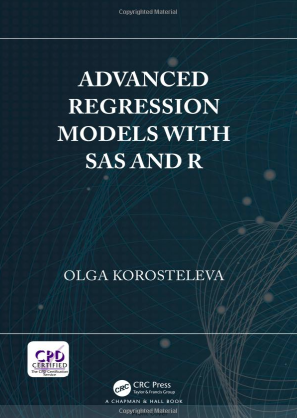

# Introduction

.pull-left[
.medium[
* Regression Short Course
    * Dr. Olga Korosteleva
    * 2019-10-05
    * Hosted at UCI
    * Tickets onsale ($25)
    * https://tinyurl.com/ocrug-regression
    * Looking for volunteers
]
]

.pull-right[

.medium[
* Recruiting
    * Gustov Mentzer
    * 949.223.1468
    * GMentzer@kforce.com
]
]


```{r setup, include=FALSE}
options(htmltools.dir.version = FALSE)
options(servr.daemon = TRUE)
```
---
# Welcome
.large[
* Newcomers
* Schedule
    * 6:30 - 6:50 Networking
    * 6:50 - 7:00 Welcome & general announcement
    * 7:00 - 7:30 Convolutional Neural Networks
    * 7:30 - 8:00 Speeding up R with Rcpp
    * 8:00 - 8:30 Networking and Clean-up
]

---
# Connect with us
.large[
* Website: https://www.ocrug.org/
* GitHub: https://tinyurl.com/ocrug-github
* Slack: https://tinyurl.com/ocrug-slack
    * Signup: https://tinyurl.com/ocrug-slack-signup
* YouTube: https://tinyurl.com/ocrug-youtube
* Twitter @oc_rug 
* Instagram: oc_rug
]

---
# Announcements
.large[
* Data Science Go
    * John will be speaking and on a panel
    * Data Science Conference, Sept 27-29
    * Discount Code: OCRUGMeetup (20% off)
    * Cost: $595 / $225 (student)
]

---
# Announcements

.pull-left[
.medium[
* Regression Short Course
    * Dr. Olga Korosteleva
    * 2019-10-05
    * Hosted at UCI
    * Tickets onsale ($25)
    * https://tinyurl.com/ocrug-regression
    * Looking for volunteers
]
]

.pull-right[

]

---
# Announcements
.large[
* Hackathon
    * Partnering with UCI 
    * 2019-11-09 to 2019-11-10
    * Tickets onsale 2019-09-26
]

---
background-image: url('ocrug_hex.png')

# Stickers

## We have custom OCRUG Hex Stickers

---
# Sponsors


.medium[
* KForce Technology Staffing
    * Gustov Mentzer
    * 949.223.1468
    * GMentzer@kforce.com
 
]

---
# Talks
.large[
* Convolutional Neural Networks
    * Speaker: Ash Pahwa
* Speeding up R with Rcpp
    * Speaker: Luke Klein
]

---
# Upcoming events
.large[
* October Meetup - 2019-10-29
    * The YAML problem: Writing and working with YAML with ymlthis
        * Speaker: Malcolm Barrett
    * Snakes in the Studio: Adding Python to your R Workflow
        * Speaker: Michael Espero
]


---
# Upcoming events

.large[
PeopleSpace is doing an October AI Series

Every Wednesday in October

1. 10/2 Wednesday https://psai1.eventbrite.com
2. 10/9 Wednesday https://psai2.eventbrite.com
]
---
# Upcoming events
.large[
* Regression Short Course
    * Dr. Olga Korosteleva
    * 2019-10-05
    * https://tinyurl.com/ocrug-regression
* Hackathon
    * 2019-11-09 to 2019-11-10
]
---
# Connect with us
.large[
* Website: https://www.ocrug.org/
* GitHub: https://tinyurl.com/ocrug-github
* Slack: https://tinyurl.com/ocrug-slack
    * Signup: https://tinyurl.com/ocrug-slack-signup
* YouTube: https://tinyurl.com/ocrug-youtube
* Twitter @oc_rug 
* Instagram: oc_rug
]
