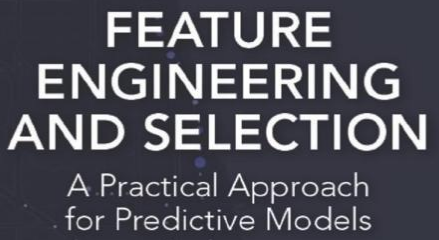
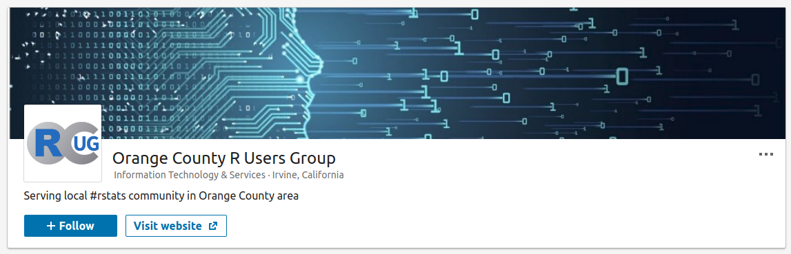

```{r setup, include=FALSE}
options(htmltools.dir.version = FALSE)
options(servr.daemon = TRUE)
```

# Welcome

.large[
* Newcomers
* Volunteers
* Schedule
    * 6:30 - 6:50 Networking
    * 6:50 - 7:00 Welcome & general announcement
    * 7:00 - 8:00 reticulate: R Interface to Python
    * 8:00 - 8:30 Networking and Clean-up
]

---
# Sponsors


---
# New format
.large[
* Alternating formats
    * hour long tutorial
    * two 30-min presentations
]
---
# R for Data Science Book Club
.pull-left[
* Same people meet weekly
* People commit to comming each week
* Leader does a review of the material
* Group works on selected problems
* Small group
* Demand out meets capacity
]

.pull-right[

]

---
# Feature Engineering Book Club

.pull-left[
* Starting 26 Feb
* Same format as the R for Data Science Book Club
* Open to new members
]

.pull-right[

]

---
# Starting a Book Club

* There is a lot of interest
* If you are interested in starting one I can help you
* What you need to do:
    * pick a book
    * find a location
    * coordinate with me to manage it on Meetup.com

---
# Linkedin Group
.large[
* https://www.linkedin.com/company/ocrug/
]



---
# Connect with us
.large[
* Website: https://www.ocrug.org/
* GitHub: https://tinyurl.com/ocrug-github
* Slack: https://tinyurl.com/ocrug-slack
* Signup: https://tinyurl.com/ocrug-slack-signup
* YouTube: https://tinyurl.com/ocrug-youtube
* Twitter @oc_rug
* Instagram: oc_rug
* Linkedin: https://tinyurl.com/ocrug-linkedin
]

---
# Talks
.large[
* reticulate: R Interface to Python
    * Speaker: Michael Espero
]
