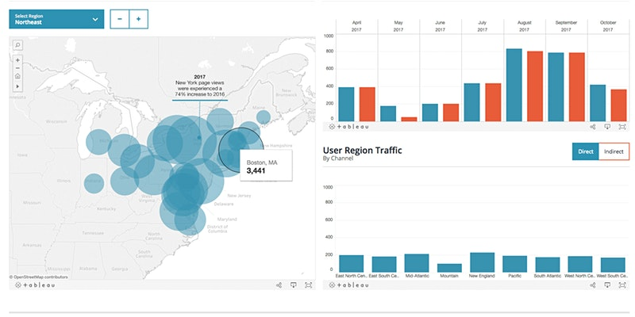

```{r setup, include=FALSE}
options(htmltools.dir.version = FALSE)
options(servr.daemon = TRUE)
```

# Welcome

.large[
* Newcomers
* Volunteers
* Schedule
    * 6:30 - 6:50 Networking
    * 6:50 - 7:00 Welcome & general announcement
    * 7:00 - 7:30 Using R in Power BI
    * 7:30 - 8:00 Basketball: Let's Explore March Madness with ncaahoopR
    * 8:00 - 8:30 Networking and Clean-up
]

---
# Sponsors


---
# New format
.large[
* Alternating formats
    * hour long tutorial
    * two 30-min presentations
]
---
# R for Data Science Book Club

.pull-left[
* Just completed the book last week
* Ran from Jan 8 to Feb 19
* Thanks to Xi Chen for organizing it
]

.pull-right[

]

---
# Feature Engineering Book Club

.pull-left[
* Same people meet weekly
* People commit to coming each week
* Leader does a review of the material
* Group works on selected problems
* Small group
* Demand out meets capacity
* Starting 26 Feb
* Currently full
]

.pull-right[

]

---
# Starting a Book Club

* There is a lot of interest
* If you are interested in starting one I can help you
* What you need to do:
    * pick a book
    * find a location
    * coordinate with me to manage it on Meetup.com

---
class: large

# From Data to Dashboards in a Day


When: 2020-03-14 1:30 - 5:30  
Where: UCI  
Cost: $5  
Registration: (limited seating) https://tinyurl.com/ocrug-dashboard

---
# Hackathon
.large[
* Partnering with UCI 
* Dates: April / May still looking working on this
* Tickets on sale soon
* Looking for volunteers to help out
]


---
# Linkedin Group
.large[
* https://www.linkedin.com/company/ocrug/
]


---
# Connect with us
.large[
* Website: https://www.ocrug.org/
* GitHub: https://tinyurl.com/ocrug-github
* Slack: https://tinyurl.com/ocrug-slack
* Signup: https://tinyurl.com/ocrug-slack-signup
* YouTube: https://tinyurl.com/ocrug-youtube
* Twitter @oc_rug
* Instagram: oc_rug
* Linkedin: https://tinyurl.com/ocrug-linkedin
]

---
# Talks
.large[
* Using R in Power BI
    * Speaker: Suresh Datla
* Basketball: Let's Explore March Madness with ncaahoopR
    * Speaker: Luke Morris
]
